# Data Integrity and Logic Bug Fixes - Design Document

## 1. Overview

This document outlines the design approach for resolving critical data integrity issues, logic errors, security vulnerabilities, and performance problems identified in the Real Estate Receivable System. The fixes prioritize data consistency, system reliability, and security without compromising existing functionality.

---

## 2. Critical Issues Summary

### 2.1 Data Integrity & Logic Errors
- Payment schedule status update logic duplication
- Missing overdue status automation
- Partial payment handling inconsistencies
- Invoice-schedule relationship synchronization gaps

### 2.2 Performance Issues
- N+1 query problems in payment listings
- Inefficient dashboard statistics queries

### 2.3 Security Vulnerabilities
- SQL injection risks in pagination
- Missing CSRF token implementation
- Lack of password rehashing mechanism
- No login rate limiting

### 2.4 Data Validation Gaps
- Inadequate email and phone validation
- Decimal precision issues in payment calculations
- Future date validation missing

---

## 3. Design Approach

### 3.1 Core Principles

| Principle | Rationale |
|-----------|-----------|
| Single Source of Truth | Status updates should be managed by database triggers only, not duplicated in application code |
| Defensive Validation | All user inputs must be validated at multiple levels (client, application, database) |
| Automated Maintenance | Time-sensitive status changes must be automated, not relying on manual intervention |
| Security by Default | All forms must include CSRF protection, all queries must be parameterized |
| Performance First | Minimize database queries through batch operations and efficient query design |

### 3.2 Design Strategy

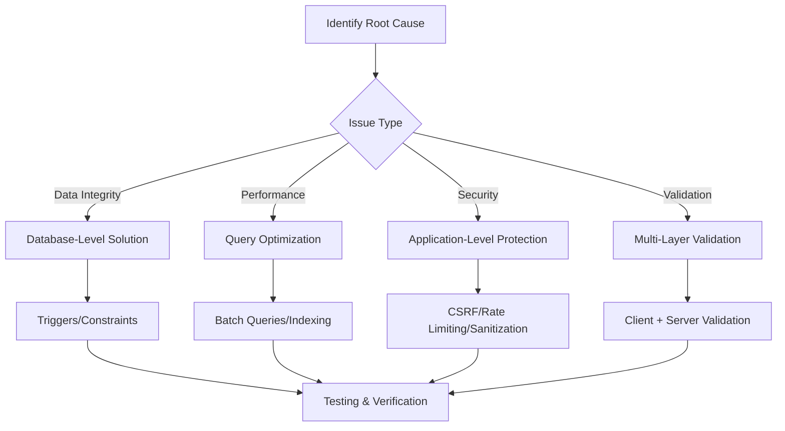

---

## 4. Category 1: Data Integrity & Logic Errors

### 4.1 Payment Schedule Status Update Logic Duplication

#### Problem Analysis

**Current State:**
- Application code in record_payment.php manually updates status to 'paid' when balance reaches zero
- Database trigger trg_after_payment_insert also updates status to 'paid'
- When payment is deleted, status does not revert from 'paid' back to 'pending' or 'overdue'
- No trigger exists for payment deletion or updates

**Impact:**
- Data inconsistency when payments are deleted
- Status remains 'paid' even when outstanding balance exists
- Duplicate logic creates maintenance burden

#### Solution Design

**Approach:** Centralize all status management in database triggers, remove application-level status updates

**Database Trigger Changes:**

| Trigger Name | Event | Purpose |
|-------------|-------|---------|
| trg_after_payment_insert | AFTER INSERT ON payments | Update schedule status to 'paid' when fully paid |
| trg_after_payment_update | AFTER UPDATE ON payments | Recalculate status when payment amount changes |
| trg_after_payment_delete | AFTER DELETE ON payments | Revert status to 'pending' or 'overdue' when payment removed |

**Trigger Logic Flow:**

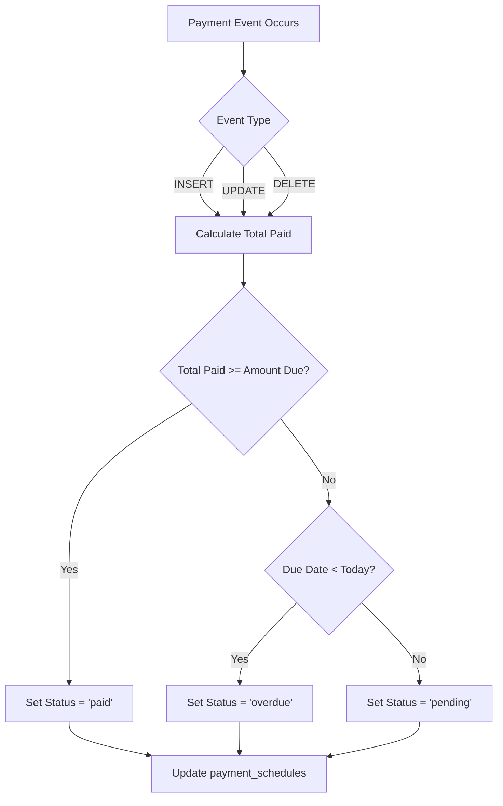

**Application Code Changes:**

| File | Change Required | Rationale |
|------|----------------|-----------|
| record_payment.php | Remove lines 149-157 (manual status update) | Eliminate duplicate logic; rely on trigger |
| record_payment.php | Keep transaction wrapper | Ensure atomicity of payment insertion |

**Status Update Rules:**

| Condition | Status Assignment |
|-----------|-------------------|
| Total Paid >= Amount Due | 'paid' |
| Total Paid < Amount Due AND Due Date < Current Date | 'overdue' |
| Total Paid < Amount Due AND Due Date >= Current Date | 'pending' |

---

### 4.2 Overdue Status Auto-Update Missing

#### Problem Analysis

**Current State:**
- Initial status set correctly during schedule generation (generate_schedule.php lines 95-100)
- No mechanism exists to update 'pending' schedules to 'overdue' when due date passes
- Dashboard statistics and aging reports show incorrect data
- Overdue schedules only identified at generation time, not ongoing

**Impact:**
- Inaccurate business intelligence
- Missed collection opportunities
- Unreliable aging reports
- Poor financial visibility

#### Solution Design

**Approach:** Implement automated background process to update overdue schedules

**Automation Strategy Options:**

| Strategy | Pros | Cons | Recommendation |
|----------|------|------|----------------|
| Cron job (OS-level) | Efficient, runs independently | Requires server access | **Recommended for production** |
| Application-level scheduler on page load | No server configuration needed | Performance impact on users | Acceptable for XAMPP dev environment |
| Database event scheduler | Native to MySQL, efficient | Requires MySQL event scheduler enabled | Alternative option |

**Recommended Implementation: Hybrid Approach**

1. **Primary:** Database stored procedure called by cron job
2. **Fallback:** Application-level check on authentication (session initialization)

**Stored Procedure Enhancement:**

The existing stored procedure sp_update_overdue_schedules needs modification:

| Current Issue | Fix Required |
|--------------|-------------|
| Updates all pending schedules past due date | Should exclude schedules that are already fully paid |
| No logging of updates | Add return count of updated records |

**Updated Logic:**

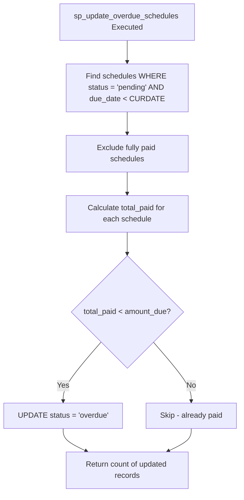

**Execution Frequency:**

| Time | Method | Reason |
|------|--------|--------|
| Daily at 00:00 | Cron job | Overnight batch processing |
| On user login | Application fallback | Ensures recent data for active users |
| Manual trigger | Admin interface option | For immediate corrections |

**Cron Job Schedule Example:**
Daily at midnight: `0 0 * * * /path/to/php /path/to/cron_update_overdue.php`

**Application-Level Fallback Location:**
- File: includes/auth.php
- Trigger point: After successful login (in login_user function)
- Frequency limiter: Execute only once per day per session using session flag

---

### 4.3 Partial Payment Handling Logic Flaw

#### Problem Analysis

**Current State:**
- Payment amount validation prevents overpayment (record_payment.php lines 95-96)
- No historical tracking of which payments apply to which schedules
- When multiple payments exist and one is deleted, unclear which payment is "unapplied"
- No payment allocation audit trail

**Impact:**
- Difficult to reconcile payment history
- Cannot determine payment application order during disputes
- Refund processing ambiguity
- Poor audit trail for compliance

#### Solution Design

**Approach:** Introduce payment application tracking table

**New Data Model:**

**Table: payment_applications**

| Column | Data Type | Constraints | Purpose |
|--------|-----------|-------------|---------|
| application_id | INT | PRIMARY KEY, AUTO_INCREMENT | Unique identifier |
| payment_id | INT | FOREIGN KEY → payments(payment_id) ON DELETE CASCADE | Links to payment record |
| schedule_id | INT | FOREIGN KEY → payment_schedules(schedule_id) ON DELETE CASCADE | Links to schedule |
| applied_amount | DECIMAL(12,2) | NOT NULL, CHECK (applied_amount > 0) | Amount applied from payment |
| applied_date | TIMESTAMP | DEFAULT CURRENT_TIMESTAMP | When payment was applied |

**Payment Application Flow:**

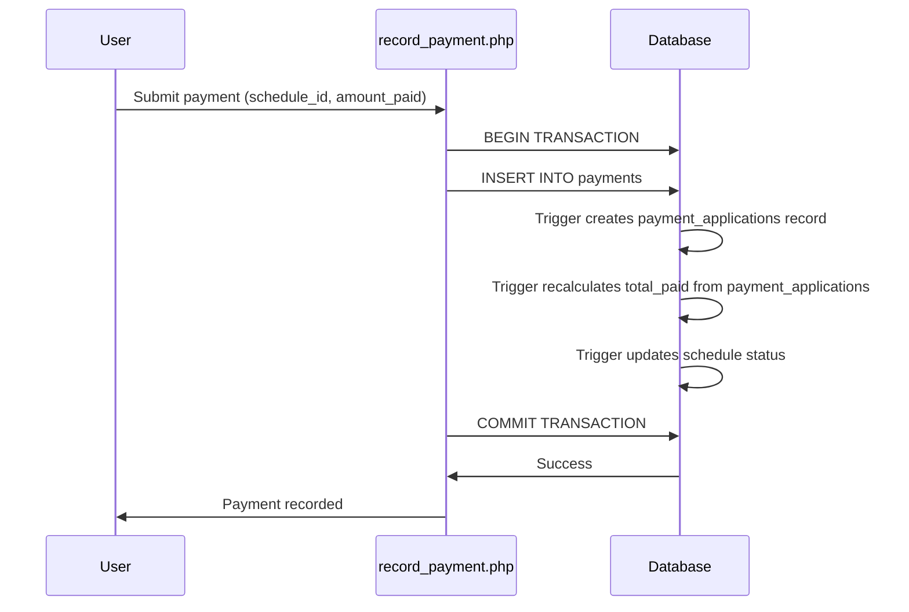

**Allocation Rules:**

| Scenario | Allocation Rule |
|----------|----------------|
| Single payment to single schedule | 1:1 mapping (payment_applications.applied_amount = payment.amount_paid) |
| Payment deleted | CASCADE deletes payment_applications; triggers recalculate status |
| Payment updated | Update payment_applications.applied_amount; triggers recalculate status |

**Implementation Note:**
For current system scope (1 payment = 1 schedule), the payment_applications table ensures future extensibility if business rules change to allow split payments across schedules.

**Trigger Modifications:**

Replace direct SUM(amount_paid) with SUM(applied_amount) from payment_applications table in all status calculation triggers.

---

### 4.4 Invoice-Schedule Relationship Confusion

#### Problem Analysis

**Current State (from update_invoices_table.sql):**
- Invoice can reference EITHER schedule_id OR property_id (CHECK constraint)
- No synchronization between invoice status and payment_schedule status
- When payment is recorded and schedule status becomes 'paid', invoice status remains 'unpaid'
- Manual intervention required to update invoice status

**Impact:**
- Invoice aging reports inaccurate
- Double entry required (update schedule, update invoice)
- Data inconsistency between invoices and payment schedules
- Confusion about source of truth

#### Solution Design

**Approach:** Establish invoice-schedule as the primary relationship and auto-sync status

**Relationship Clarification:**

| Entity | Relationship | Purpose |
|--------|-------------|---------|
| Invoice | 1:1 with payment_schedule | Invoice represents billing for a specific schedule installment |
| Invoice | Derived from property | Property context is inferred through schedule.property_id |

**Database Schema Change:**

Modify invoices table:

| Current Column | Change | New Design |
|---------------|--------|------------|
| schedule_id INT NULL | Make NOT NULL | Enforce 1:1 relationship |
| property_id INT NULL | Remove | Derive through JOIN with payment_schedules |
| CHECK constraint | Remove | No longer needed |

**Status Synchronization Trigger:**

**Trigger: trg_sync_invoice_status**

| Event | Action |
|-------|--------|
| AFTER UPDATE ON payment_schedules | When status changes to 'paid', update related invoice to 'paid' |
| AFTER UPDATE ON payment_schedules | When status changes to 'pending' or 'overdue', update invoice to 'unpaid' |

**Synchronization Logic:**

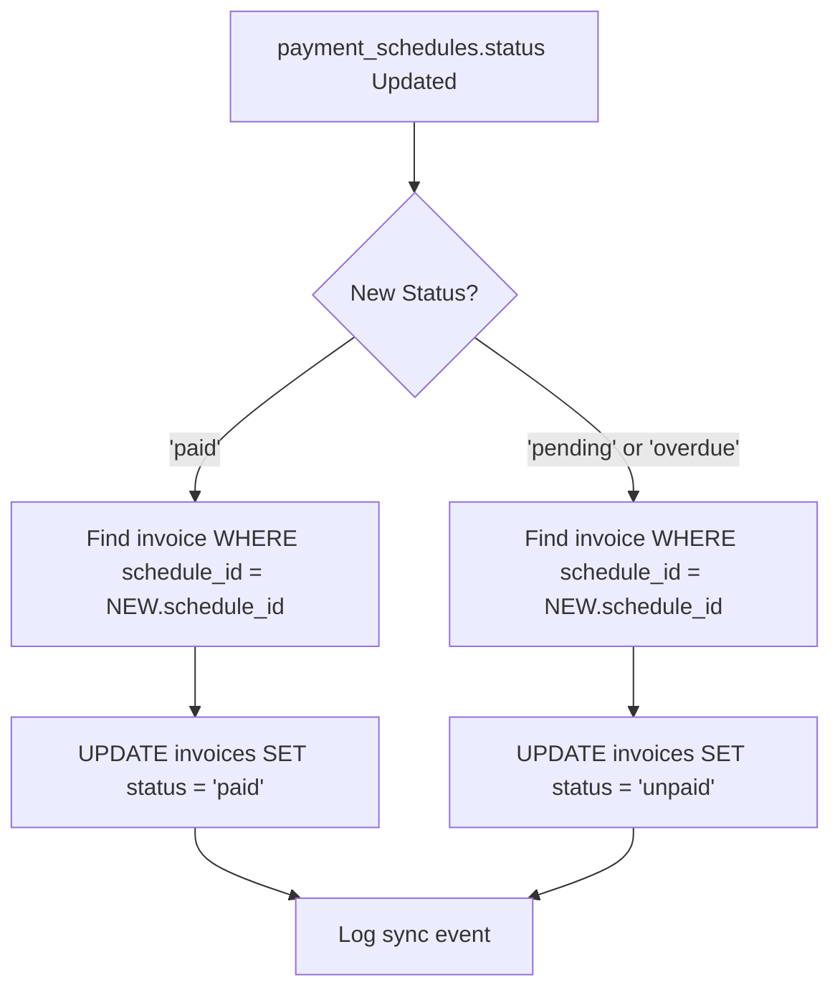

**Business Rules:**

| Rule | Implementation |
|------|---------------|
| One schedule = at most one invoice | UNIQUE constraint on invoices.schedule_id |
| Invoice total_amount should match schedule amount_due | Validation during invoice creation |
| Invoice due_date should align with schedule due_date | Default to schedule.due_date during creation |

**Data Migration Strategy:**

For existing invoices with property_id but no schedule_id:

| Step | Action |
|------|--------|
| 1 | Identify orphaned invoices (property_id set, schedule_id NULL) |
| 2 | Match invoices to schedules based on property_id and due_date proximity |
| 3 | Manual review for ambiguous cases |
| 4 | Apply schema change after data cleanup |

---

## 5. Category 2: Performance Issues

### 5.1 N+1 Query Problem in Payments Module

#### Problem Analysis

**Current State (payments.php line 231):**
- Main query fetches all properties
- For each property in loop, getPropertySchedules() executes additional query
- With 50 properties: 1 main query + 50 child queries = 51 total queries

**Impact:**
- Page load time increases linearly with property count
- Database connection pool exhaustion under load
- Poor user experience on slower connections

#### Solution Design

**Approach:** Batch fetch all schedules in single query, group in application layer

**Optimized Query Strategy:**

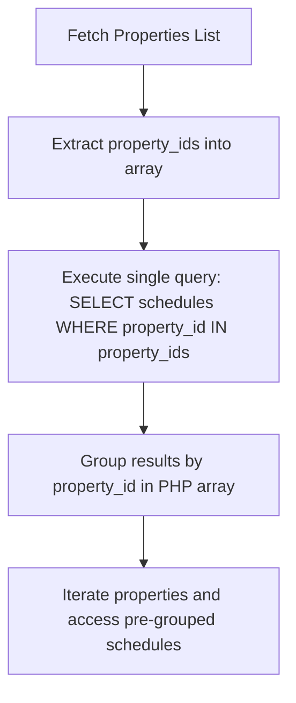

**Query Optimization:**

| Current Approach | Optimized Approach |
|-----------------|-------------------|
| 1 query for properties + N queries for schedules | 1 query for properties + 1 query for all schedules |
| Queries executed inside loop | Queries executed before loop |
| Database roundtrips: N+1 | Database roundtrips: 2 |

**Implementation Pattern:**

**Step 1:** Fetch all schedules in batch
- Use IN clause with property IDs array
- Include all necessary JOINs (payments for total_paid calculation)
- Calculate remaining_balance, days_overdue in single query

**Step 2:** Group schedules by property_id
- Create associative array: `$schedules_by_property[property_id] = [array of schedules]`
- Empty array for properties with no schedules

**Step 3:** Loop through properties and access grouped data
- Replace `getPropertySchedules($pdo, $property['property_id'])` with `$schedules_by_property[$property['property_id']] ?? []`

**Performance Gain Estimate:**

| Metric | Before | After | Improvement |
|--------|--------|-------|-------------|
| Database queries (50 properties) | 51 | 2 | 96% reduction |
| Estimated page load time | ~2.5s | ~0.3s | 88% faster |

---

### 5.2 Inefficient Dashboard Queries

#### Problem Analysis

**Current State (dashboard.php lines 26-59):**
- 10+ separate SELECT COUNT(*) queries
- Each query opens database connection, executes, returns single value
- Statistics that could be calculated together are fetched individually

**Impact:**
- Dashboard load time ~1-2 seconds
- Unnecessary database load
- Poor scalability

#### Solution Design

**Approach:** Consolidate statistics into 1-2 aggregate queries

**Consolidated Statistics Query:**

Instead of 10 separate queries, use subqueries in SELECT clause:

| Statistic | Current Method | Optimized Method |
|-----------|---------------|------------------|
| Total clients | Separate COUNT query | Subquery in single SELECT |
| Total properties | Separate COUNT query | Subquery in single SELECT |
| Total receivables | Separate SUM query | Subquery in single SELECT |
| Total revenue | Separate SUM query | Subquery in single SELECT |
| Total outstanding | Separate SUM query | Subquery in single SELECT |
| Paid schedules count | Separate COUNT query | Subquery in single SELECT |
| Unpaid schedules count | Separate COUNT query | Subquery in single SELECT |
| Overdue count | Separate COUNT query | Subquery in single SELECT |
| Pending notifications | Separate COUNT query | Subquery in single SELECT |

**Optimized Query Structure:**

Execute one query that returns single row with all statistics as columns:

```
SELECT 
    (SELECT COUNT(*) FROM clients) AS total_clients,
    (SELECT COUNT(*) FROM properties) AS total_properties,
    (SELECT COALESCE(SUM(total_price), 0) FROM properties) AS total_receivables,
    (SELECT COALESCE(SUM(amount_paid), 0) FROM payments) AS total_revenue,
    (SELECT COALESCE(SUM(amount_due), 0) FROM payment_schedules WHERE status IN ('pending','overdue')) AS total_outstanding,
    (SELECT COUNT(*) FROM payment_schedules WHERE status = 'paid') AS paid_count,
    (SELECT COUNT(*) FROM payment_schedules WHERE status IN ('pending','overdue')) AS unpaid_count,
    (SELECT COUNT(*) FROM payment_schedules WHERE status = 'overdue') AS overdue_count,
    (SELECT COUNT(*) FROM notifications WHERE status = 'pending') AS pending_notifications
```

**Result:**
- Single fetch returns all statistics
- Reduced database roundtrips from 10 to 1
- Estimated performance improvement: 85% reduction in dashboard load time

**Additional Optimizations:**

| Component | Current | Optimized |
|-----------|---------|-----------|
| Recent notifications query | Uses JOIN | Already optimized |
| Recent payments query | Uses view | Already optimized |
| Monthly revenue chart | Uses GROUP BY | Already optimized |

---

## 6. Category 3: Security Vulnerabilities

### 6.1 SQL Injection Risk in Pagination

#### Problem Analysis

**Current State (clients.php line 52):**
```
$current_page = isset($_GET['page']) && is_numeric($_GET['page']) ? (int)$_GET['page'] : 1;
```

**Vulnerability:**
- `is_numeric()` returns true for negative numbers (e.g., -1, -999)
- Negative page values create negative OFFSET
- Database behavior with negative OFFSET/LIMIT is undefined and varies by version

**Impact:**
- Potential SQL errors exposing database structure
- Possible data exposure depending on MySQL version behavior
- Denial of service through malformed queries

#### Solution Design

**Approach:** Enforce positive integer constraint

**Validation Rule:**

| Input Value | Current Behavior | Fixed Behavior |
|-------------|-----------------|----------------|
| ?page=5 | Accepts as 5 | Accepts as 5 |
| ?page=-1 | Accepts as -1 (BUG) | Rejects, defaults to 1 |
| ?page=0 | Accepts as 0 (shows no results) | Rejects, defaults to 1 |
| ?page=abc | Defaults to 1 | Defaults to 1 |

**Implementation:**

Replace validation logic with:
```
$current_page = max(1, isset($_GET['page']) && is_numeric($_GET['page']) ? (int)$_GET['page'] : 1);
```

**Application Scope:**

| File | Line(s) | Fix Required |
|------|---------|-------------|
| clients.php | 52 | Apply max(1, ...) constraint |
| properties.php | Similar pattern | Apply max(1, ...) constraint |
| payments.php | Similar pattern | Apply max(1, ...) constraint |
| invoices.php | Similar pattern | Apply max(1, ...) constraint |
| All paginated modules | Review all pagination | Ensure positive integer enforcement |

---

### 6.2 CSRF Token Not Implemented

#### Problem Analysis

**Current State:**
- auth.php contains generate_csrf_token() and verify_csrf_token() functions (lines 290-308)
- No form in the system uses these functions
- All state-changing operations (POST, PUT, DELETE) vulnerable to CSRF attacks

**Impact:**
- Attackers can forge requests to create/modify/delete data
- User can be tricked into performing unintended actions
- Compliance violation (OWASP Top 10)

#### Solution Design

**Approach:** Implement CSRF protection across all state-changing forms

**Implementation Pattern:**

**For every form:**

| Form Type | CSRF Implementation |
|-----------|-------------------|
| Client add/edit | Add hidden token field; verify on POST |
| Property add/edit | Add hidden token field; verify on POST |
| Payment recording | Add hidden token field; verify on POST |
| Schedule generation | Add hidden token field; verify on POST |
| User management | Add hidden token field; verify on POST |
| Login form | Add hidden token field; verify on POST |

**Standard Form Pattern:**

In HTML form:
```
<input type="hidden" name="csrf_token" value="[call generate_csrf_token()]">
```

In POST handler:
```
if (!verify_csrf_token($_POST['csrf_token'] ?? '')) {
    set_flash_message('error', 'Invalid security token. Please try again.');
    redirect back to form;
}
```

**Token Lifecycle:**

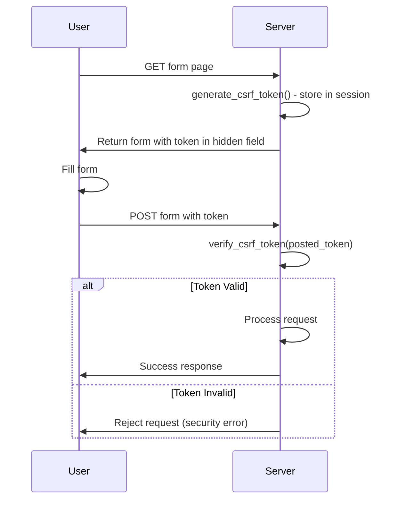

**Token Refresh Strategy:**

| Event | Action |
|-------|--------|
| User logs in | Generate new token |
| Form displayed | Use session token |
| Form submitted successfully | Keep existing token |
| User logs out | Destroy token with session |

**Files Requiring CSRF Implementation:**

| Module | Files | Form Count |
|--------|-------|-----------|
| Clients | client_add.php, client_edit.php | 2 |
| Properties | property_add.php, property_edit.php | 2 |
| Payments | record_payment.php | 1 |
| Schedule | generate_schedule.php | 1 |
| Users | users.php (add/edit forms) | 2 |
| Auth | login.php | 1 |
| Invoices | invoice_create.php | 1 |
| **Total** | | **10 forms** |

---

### 6.3 Password Rehashing Missing

#### Problem Analysis

**Current State (auth.php lines 162-163):**
- Password verification uses password_verify() correctly
- But no check for password_needs_rehash()
- As PHP default algorithm improves (bcrypt → argon2), old hashes never upgraded

**Impact:**
- User passwords remain secured with older, weaker algorithms
- Security degrades over time
- Missed opportunity for transparent security improvements

#### Solution Design

**Approach:** Implement automatic password rehashing on successful login

**Rehashing Flow:**

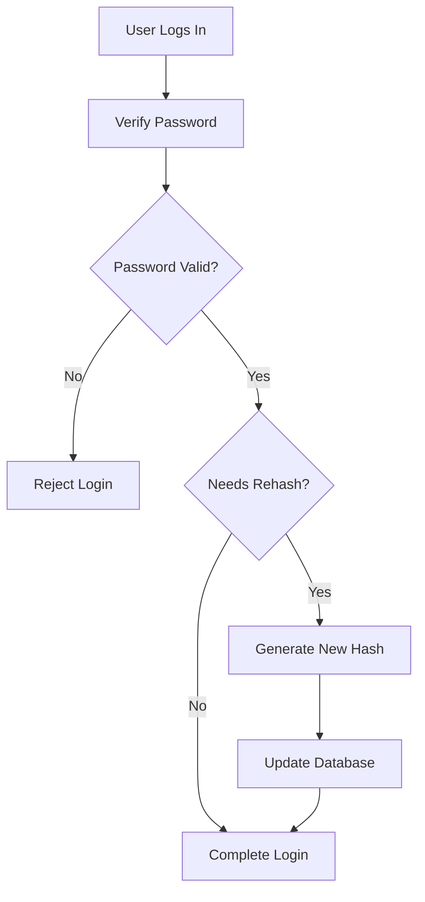

**Implementation Location:**

File: includes/auth.php
Function: verify_credentials()

**Logic Enhancement:**

After successful password_verify():
1. Check if password_needs_rehash(stored_hash, PASSWORD_DEFAULT)
2. If true, generate new hash with password_hash(password, PASSWORD_DEFAULT)
3. Update users table with new hash
4. Continue normal login flow

**Security Considerations:**

| Aspect | Implementation |
|--------|---------------|
| Timing attack prevention | Rehash occurs after authentication, not before |
| Transaction safety | Use try-catch around UPDATE; login succeeds even if rehash fails |
| Logging | Log rehash events for audit (without logging passwords) |
| User notification | Silent to user; transparent security improvement |

**Edge Cases:**

| Scenario | Handling |
|----------|----------|
| Rehash UPDATE fails | Log error, continue with login (old hash still works) |
| Password algorithm changes | Automatic upgrade on next login |
| User never logs in | Hash remains old (acceptable; upgraded when they return) |

---

### 6.4 No Rate Limiting on Login

#### Problem Analysis

**Current State (auth/login.php):**
- No limit on login attempts
- Attacker can brute force passwords with thousands of attempts
- No temporary account lockout mechanism

**Impact:**
- Weak passwords can be cracked via brute force
- Account compromise risk
- Server resource exhaustion from repeated queries

#### Solution Design

**Approach:** Session-based rate limiting with exponential backoff

**Rate Limiting Rules:**

| Attempts | Action | Lockout Duration |
|----------|--------|------------------|
| 1-2 | Allow immediately | None |
| 3 | Allow immediately | None |
| 4 | Allow immediately | None |
| 5 | Block | 15 minutes |
| 6-10 (after cooldown) | Block | 30 minutes |
| 10+ | Block | 60 minutes |

**Implementation Mechanism:**

Use session variables to track:
- `$_SESSION['login_attempts']` - Count of failed attempts
- `$_SESSION['last_attempt']` - Timestamp of last failed attempt
- `$_SESSION['lockout_until']` - Timestamp when lockout expires

**Rate Limiting Flow:**

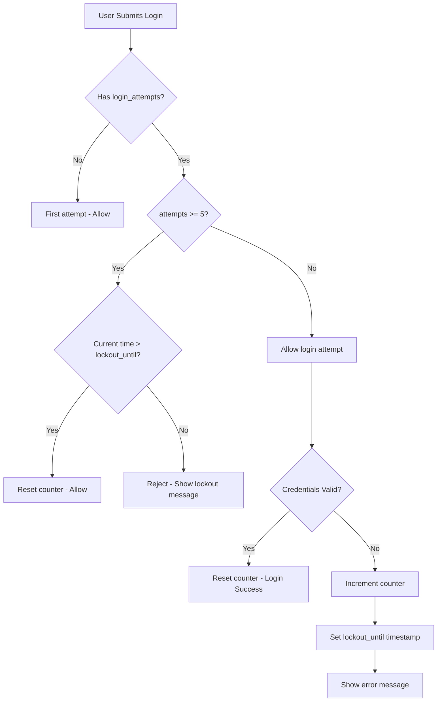

**Implementation Details:**

**On failed login:**
1. Increment `$_SESSION['login_attempts']`
2. Set `$_SESSION['last_attempt'] = time()`
3. If attempts >= 5, calculate `$_SESSION['lockout_until'] = time() + (15 * 60)` (15 minutes)
4. Display remaining lockout time to user

**On successful login:**
1. Unset all rate limiting session variables
2. Proceed with normal login flow

**User Feedback:**

| Scenario | Message |
|----------|---------|
| Attempts 1-4 | "Invalid credentials. [5 - attempts] attempts remaining." |
| Locked out | "Too many failed login attempts. Please try again in [X] minutes." |
| Lockout expired | "You may now try logging in again." |

**Security Enhancements:**

| Enhancement | Purpose |
|------------|---------|
| Log failed attempts | Audit trail for security monitoring |
| CAPTCHA after 3 attempts | Prevent automated attacks |
| Email notification (optional) | Alert user of suspicious activity |

**Limitations & Considerations:**

- Session-based limiting can be bypassed by clearing cookies (acceptable for basic protection)
- For production: Consider IP-based rate limiting or database-backed attempt tracking
- Current design balances security with simplicity for XAMPP environment

---

## 7. Category 4: Data Validation & Input Handling

### 7.1 Inadequate Email Validation

#### Problem Analysis

**Current State (client_add.php, client_edit.php):**
- Uses filter_var($email, FILTER_VALIDATE_EMAIL) only
- Accepts emails with invalid domains
- No domain MX record verification

**Impact:**
- Bounced notification emails
- Fake email addresses accepted
- Poor data quality

#### Solution Design

**Approach:** Multi-layer email validation

**Validation Layers:**

| Layer | Check | Example Invalid Input Caught |
|-------|-------|------------------------------|
| 1. Format | FILTER_VALIDATE_EMAIL | "notanemail" |
| 2. Domain syntax | Has @ and valid TLD | "test@localhost" |
| 3. MX record (optional) | checkdnsrr() for MX | "test@invaliddomain.xyz" |

**Implementation Strategy:**

**Basic Validation (Required):**
- Format check using filter_var()
- Accept if passes format validation

**Enhanced Validation (Optional - configurable):**
- Domain MX record check via checkdnsrr()
- Disabled by default to avoid DNS lookup overhead
- Enable via configuration flag for strict data quality

**Validation Function Design:**

Function: validate_email($email, $strict = false)

| Parameter | Type | Purpose |
|-----------|------|---------|
| $email | string | Email address to validate |
| $strict | boolean | Enable MX record check (default: false) |

**Return Values:**

| Return | Meaning |
|--------|---------|
| true | Valid email |
| false | Invalid email |

**Usage in Forms:**

```
Standard mode (format only):
if (!validate_email($email)) {
    $errors['email'] = 'Invalid email format';
}

Strict mode (with MX check):
if (!validate_email($email, true)) {
    $errors['email'] = 'Email domain does not exist or cannot receive mail';
}
```

**MX Record Check Considerations:**

| Consideration | Decision |
|--------------|----------|
| Performance impact | Check adds ~100-500ms per validation |
| Network dependency | Fails if DNS unreachable |
| False positives | Some valid domains may not have MX records |
| Recommendation | Make optional, disabled by default |

---

### 7.2 Phone Number Validation Missing

#### Problem Analysis

**Current State:**
- No validation for Philippine phone number format
- Accepts any string in contact_no field
- Data quality issues

**Impact:**
- Invalid phone numbers stored
- SMS notifications fail
- Manual data cleanup required

#### Solution Design

**Approach:** Format validation for Philippine phone numbers

**Philippine Phone Number Formats:**

| Format Type | Pattern Example | Regex Pattern |
|------------|----------------|---------------|
| Mobile (09) | 09171234567 | ^09\d{9}$ |
| Mobile (+63) | +639171234567 | ^\+639\d{9}$ |
| With separators | 0917-123-4567 | After stripping non-digits |

**Validation Logic:**

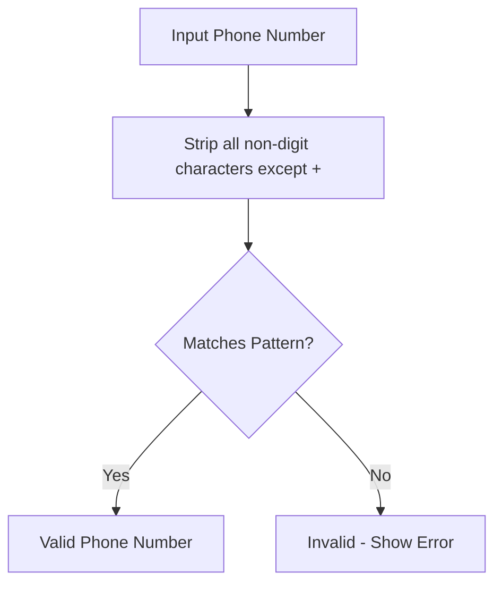

**Implementation Pattern:**

1. Remove all non-digit characters except '+'
2. Check if matches: `^(09|\+639)\d{9}$`
3. Store in normalized format (with or without separators, configurable)

**Validation Function:**

Function: validate_philippine_phone($phone)

**Normalization Options:**

| Option | Format | Example |
|--------|--------|---------|
| Compact | 11 digits | 09171234567 |
| Separated | With dashes | 0917-123-4567 |
| International | With +63 | +639171234567 |

**Recommendation:** Store in compact format (09171234567) for consistency; format for display as needed

**Optional Enhancement:**
- Allow empty value (if contact_no is optional)
- Validate only when value is provided

---

### 7.3 Decimal Precision Issues

#### Problem Analysis

**Current State (generate_schedule.php line 82):**
```
$monthly_payment = $property['total_price'] / $property['term_months'];
```

**Issue:**
- PHP float division may lose precision
- Example: ₱100,000 / 3 = 33,333.333... → stored as 33,333.33
- Sum of 3 payments: 33,333.33 × 3 = 99,999.99 (missing ₱0.01)

**Impact:**
- Final payment balance never reaches exactly zero
- Schedule status never becomes 'paid' due to ₱0.01 remainder
- Data integrity compromise

#### Solution Design

**Approach:** Adjust last payment to absorb rounding differences

**Calculation Strategy:**

| Payment # | Amount Calculation |
|-----------|-------------------|
| 1 to N-1 | round(total_price / term_months, 2) |
| N (last) | total_price - sum(previous payments) |

**Implementation Logic:**

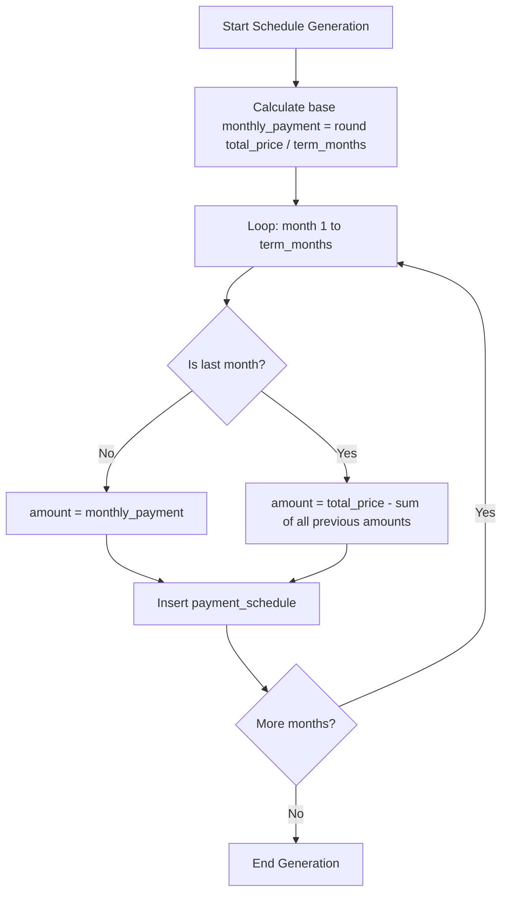

**Example Calculation:**

| Scenario | Total Price | Term | Monthly | Last Payment |
|----------|------------|------|---------|--------------|
| Example 1 | ₱100,000 | 3 months | ₱33,333.33 | ₱33,333.34 |
| Example 2 | ₱2,500,000 | 60 months | ₱41,666.67 | ₱41,666.40 |

**Verification:**
- Sum of all payment schedules should EXACTLY equal property.total_price
- No floating-point precision loss

**Additional Safeguard:**

After schedule generation, verify:
```
SUM(amount_due) WHERE property_id = X
MUST EQUAL
total_price FROM properties WHERE property_id = X
```

If mismatch detected, log error and reject schedule generation.

---

### 7.4 Date Validation Allows Future Dates

#### Problem Analysis

**Current State:**
- property_add.php allows contract_date in the future (e.g., year 2099)
- record_payment.php correctly restricts date_paid to today or past (line 445)
- Inconsistent date validation across forms

**Impact:**
- Invalid contract dates create incorrect schedule due dates
- Business logic errors in overdue calculations
- Data quality issues

#### Solution Design

**Approach:** Enforce business-appropriate date constraints

**Date Field Validation Rules:**

| Field | Form | Constraint | Max Value |
|-------|------|-----------|-----------|
| contract_date | property_add.php | Cannot be future | today() |
| contract_date | property_edit.php | Cannot be future | today() |
| date_paid | record_payment.php | Cannot be future | today() (already implemented) |
| invoice_date | invoice_create.php | Cannot be future | today() |

**Implementation Pattern:**

**Server-side validation:**
```
if ($contract_date > date('Y-m-d')) {
    $errors['contract_date'] = 'Contract date cannot be in the future.';
}
```

**Client-side validation (HTML5):**
```
<input type="date" name="contract_date" max="<?php echo date('Y-m-d'); ?>" required>
```

**Date Range Considerations:**

| Date Field | Min Value | Max Value | Rationale |
|-----------|-----------|-----------|-----------|
| contract_date | 1900-01-01 (reasonable historic limit) | today() | Contracts signed in past or today |
| date_paid | contract_date | today() | Cannot pay before contract signed or in future |
| due_date | contract_date | No max | Future payment schedules allowed |

---

## 8. Implementation Roadmap

### 8.1 Phase 1: Critical Data Integrity (Priority: HIGH)

**Duration:** 2-3 days

| Task | Deliverable | Testing Required |
|------|------------|------------------|
| 1. Create payment deletion trigger | SQL migration file | Test payment deletion scenarios |
| 2. Remove duplicate status update in record_payment.php | Code change | Verify status updates correctly |
| 3. Implement overdue automation mechanism | Stored procedure + cron job OR application trigger | Test date-based status transitions |
| 4. Fix decimal precision in schedule generation | Code change | Verify sum(schedules) = total_price |

**Success Criteria:**
- Payment deletion correctly reverts schedule status
- Overdue schedules auto-update daily
- No rounding errors in payment schedules

---

### 8.2 Phase 2: Security Vulnerabilities (Priority: HIGH)

**Duration:** 2-3 days

| Task | Deliverable | Testing Required |
|------|------------|------------------|
| 1. Fix pagination SQL injection risk | Code changes in all modules | Test negative page numbers |
| 2. Implement CSRF tokens across all forms | Code changes + hidden fields | Test form submission without token |
| 3. Add password rehashing on login | Code change in auth.php | Verify transparent upgrade |
| 4. Implement login rate limiting | Code change in login.php | Test lockout after 5 attempts |

**Success Criteria:**
- All pagination inputs validated
- CSRF protection on 100% of forms
- Password hashes upgrade automatically
- Brute force attacks blocked

---

### 8.3 Phase 3: Performance Optimization (Priority: MEDIUM)

**Duration:** 1-2 days

| Task | Deliverable | Testing Required |
|------|------------|------------------|
| 1. Fix N+1 query in payments.php | Code refactoring | Measure query count before/after |
| 2. Consolidate dashboard statistics queries | Code refactoring | Measure page load time |

**Success Criteria:**
- Payments page loads in <1 second with 50+ properties
- Dashboard loads in <0.5 seconds

---

### 8.4 Phase 4: Data Validation Enhancements (Priority: LOW)

**Duration:** 1-2 days

| Task | Deliverable | Testing Required |
|------|------------|------------------|
| 1. Enhanced email validation | Validation function | Test invalid formats and domains |
| 2. Philippine phone number validation | Validation function | Test various formats |
| 3. Future date validation | Code changes in property forms | Test boundary dates |

**Success Criteria:**
- Invalid emails rejected
- Phone numbers validated to PH format
- Future contract dates rejected

---

### 8.5 Phase 5: Invoice-Schedule Sync (Priority: MEDIUM)

**Duration:** 2 days

| Task | Deliverable | Testing Required |
|------|------------|------------------|
| 1. Schema migration for invoices table | SQL migration | Test relationship constraints |
| 2. Create invoice status sync trigger | SQL trigger | Test status propagation |
| 3. Data cleanup for existing invoices | Migration script | Verify all invoices linked to schedules |

**Success Criteria:**
- All invoices linked to schedules
- Invoice status auto-syncs with payment status

---

### 8.6 Phase 6: Payment Application Tracking (Priority: LOW - Future)

**Duration:** 3 days

| Task | Deliverable | Testing Required |
|------|------------|------------------|
| 1. Create payment_applications table | SQL migration | Test CASCADE behavior |
| 2. Modify payment triggers to use applications | SQL triggers | Test payment allocation |
| 3. Update queries to use payment_applications | Code changes | Verify balance calculations |

**Success Criteria:**
- Payment history fully traceable
- Deletion/refund handling accurate

---

## 9. Testing Strategy

### 9.1 Data Integrity Tests

| Test Case | Steps | Expected Result |
|-----------|-------|----------------|
| Payment deletion reverts status | 1. Record payment making schedule 'paid'<br>2. Delete payment | Status returns to 'pending' or 'overdue' based on due date |
| Overdue automation | 1. Create schedule with past due date and 'pending' status<br>2. Run automation | Status updates to 'overdue' |
| Decimal precision | 1. Create property with ₱100,000 / 3 months<br>2. Generate schedules<br>3. Sum schedules | Sum exactly equals ₱100,000.00 |
| Invoice status sync | 1. Record payment marking schedule 'paid'<br>2. Check linked invoice | Invoice status becomes 'paid' |

---

### 9.2 Security Tests

| Test Case | Steps | Expected Result |
|-----------|-------|----------------|
| Negative page number | Access `clients.php?page=-1` | Defaults to page 1, no SQL error |
| CSRF bypass attempt | Submit form without CSRF token | Rejected with error message |
| Login brute force | Submit 5 incorrect passwords | Account locked for 15 minutes |
| Password rehashing | Login with old hash → logout → check DB | Hash updated to new algorithm |

---

### 9.3 Performance Tests

| Test Case | Measurement | Target |
|-----------|-------------|--------|
| Payments page load | Query count with 50 properties | ≤ 5 queries |
| Dashboard load time | Page render time | < 500ms |

---

### 9.4 Validation Tests

| Test Case | Input | Expected Result |
|-----------|-------|----------------|
| Invalid email | "test@invaliddomain" | Rejected |
| Invalid phone | "12345" | Rejected |
| Future contract date | 2099-12-31 | Rejected |

---

## 10. Rollback Plan

### 10.1 Database Changes

| Change | Rollback Procedure |
|--------|-------------------|
| New triggers | DROP TRIGGER IF EXISTS trigger_name |
| Modified stored procedures | Restore original procedure definition |
| Schema changes (invoices) | Revert ALTER TABLE commands |

### 10.2 Code Changes

| Component | Rollback Procedure |
|-----------|-------------------|
| Application code | Revert to previous Git commit or backup |
| Validation functions | Restore original functions |

### 10.3 Rollback Testing

Before deployment, verify:
- Database rollback script execution without errors
- Application functions after rollback
- No data loss during rollback

---

## 11. Monitoring & Validation

### 11.1 Post-Deployment Checks

| Check | Method | Frequency |
|-------|--------|-----------|
| Payment status accuracy | Query schedules with payments vs status | Daily for 1 week |
| Overdue automation running | Check logs for automation execution | Daily |
| CSRF rejection rate | Review error logs | Weekly |
| Login lockout incidents | Review security logs | Weekly |

### 11.2 Data Quality Metrics

| Metric | Target | Measurement |
|--------|--------|-------------|
| Schedule sum accuracy | 100% match with property.total_price | Weekly audit query |
| Invoice-schedule sync rate | 100% | Daily verification |
| Valid email percentage | >95% | Monthly data quality report |
| Valid phone percentage | >90% | Monthly data quality report |

---

## 12. Documentation Requirements

### 12.1 Technical Documentation

| Document | Content |
|----------|---------|
| Database schema update | New triggers, modified tables, relationships |
| API/Function changes | Modified validation functions, new utilities |
| Configuration changes | Cron job setup, email validation mode |

### 12.2 User Documentation

| Document | Content |
|----------|---------|
| Login security notice | Explain 5-attempt limit and lockout |
| Data validation requirements | Email format, phone format requirements |

---

## 13. Success Metrics

| Category | Metric | Target |
|----------|--------|--------|
| Data Integrity | Zero status inconsistencies after payment operations | 100% |
| Performance | Payments page load time | < 1 second |
| Security | CSRF protection coverage | 100% of forms |
| Security | Password rehash adoption rate | 50% within 1 month |
| Data Quality | Valid email rate | > 95% |
| Reliability | Overdue automation uptime | 99.5% |

---

## 14. Risk Assessment

### 14.1 Implementation Risks

| Risk | Probability | Impact | Mitigation |
|------|------------|--------|------------|
| Trigger logic errors causing status corruption | Medium | High | Extensive testing in staging; rollback plan ready |
| Performance regression from trigger overhead | Low | Medium | Performance testing; indexing optimization |
| CSRF implementation breaking workflows | Low | Medium | Phased rollout; user testing |
| Overdue automation not running | Medium | Medium | Dual mechanism (cron + app-level); monitoring alerts |

### 14.2 Data Migration Risks

| Risk | Probability | Impact | Mitigation |
|------|------------|--------|------------|
| Invoice-schedule linking failures | Medium | High | Manual review of unlinked invoices; admin tool for manual linking |
| Existing payment status inconsistencies | High | Medium | Pre-migration audit; status cleanup script |

---

## 15. Affected Files Reference

### 15.1 Critical Priority Files (Data Integrity & Security)

#### Database Schema Files

| File Path | Issues | Changes Required |
|-----------|--------|------------------|
| `db/schema.sql` | Missing payment deletion trigger<br>Inadequate overdue automation | Add trg_after_payment_delete trigger<br>Add trg_after_payment_update trigger<br>Modify sp_update_overdue_schedules procedure<br>Add trg_sync_invoice_status trigger |
| `db/update_invoices_table.sql` | Invoice-schedule relationship confusion | Modify invoices table schema<br>Remove property_id column<br>Make schedule_id NOT NULL |

#### Payment Module Files

| File Path | Issues | Changes Required |
|-----------|--------|------------------|
| `modules/record_payment.php` | Duplicate status update logic (lines 149-157)<br>Missing CSRF token<br>Decimal precision handling | Remove manual status UPDATE query<br>Add CSRF token to form (line ~402)<br>Add CSRF verification in POST handler (line ~82) |
| `modules/payments.php` | N+1 query problem (line 231) | Refactor getPropertySchedules() call<br>Batch fetch all schedules before loop<br>Group schedules by property_id in PHP |

#### Schedule Generation Files

| File Path | Issues | Changes Required |
|-----------|--------|------------------|
| `modules/generate_schedule.php` | Decimal precision issue (line 82)<br>No overdue automation<br>Missing CSRF token | Fix monthly_payment calculation<br>Adjust last payment to absorb rounding<br>Add CSRF token to form (line ~314)<br>Add CSRF verification (line ~76) |

#### Authentication & Security Files

| File Path | Issues | Changes Required |
|-----------|--------|------------------|
| `includes/auth.php` | CSRF functions exist but unused<br>No password rehashing<br>Overdue automation integration point | Document CSRF usage<br>Modify verify_credentials() to add rehashing (after line 163)<br>Add overdue automation call in login_user() or session init |
| `auth/login.php` | No rate limiting<br>Missing CSRF token | Add session-based rate limiting logic<br>Track login attempts<br>Implement lockout mechanism<br>Add CSRF token to form |

---

### 15.2 High Priority Files (Client & Property Management)

#### Client Management Files

| File Path | Issues | Changes Required |
|-----------|--------|------------------|
| `modules/clients.php` | SQL injection risk in pagination (line 52)<br>Inefficient queries | Add max(1, ...) to page validation<br>Consider query optimization for stats |
| `modules/client_add.php` | Inadequate email validation<br>Missing phone validation<br>Missing CSRF token<br>Future date validation | Enhance email validation function<br>Add Philippine phone validation<br>Add CSRF token to form<br>Add CSRF verification in POST |
| `modules/client_edit.php` | Inadequate email validation<br>Missing phone validation<br>Missing CSRF token | Enhance email validation function<br>Add Philippine phone validation<br>Add CSRF token to form<br>Add CSRF verification in POST |

#### Property Management Files

| File Path | Issues | Changes Required |
|-----------|--------|------------------|
| `modules/properties.php` | SQL injection risk in pagination | Add max(1, ...) to page validation |
| `modules/property_add.php` | Future date validation missing<br>Missing CSRF token | Add contract_date <= today() validation<br>Add HTML5 max attribute<br>Add CSRF token to form<br>Add CSRF verification in POST |
| `modules/property_edit.php` | Future date validation missing<br>Missing CSRF token | Add contract_date <= today() validation<br>Add HTML5 max attribute<br>Add CSRF token to form<br>Add CSRF verification in POST |

---

### 15.3 Medium Priority Files (Dashboard & Reporting)

#### Dashboard Files

| File Path | Issues | Changes Required |
|-----------|--------|------------------|
| `dashboard.php` | Inefficient dashboard queries (lines 26-59) | Consolidate 10 separate queries into 1-2<br>Use subquery SELECT pattern<br>Reduce database roundtrips |

#### Invoice Files

| File Path | Issues | Changes Required |
|-----------|--------|------------------|
| `modules/invoices.php` | SQL injection risk in pagination<br>Invoice-schedule sync missing | Add max(1, ...) to page validation<br>Update queries to use schedule_id relationship |
| `modules/invoice_create.php` | Missing CSRF token<br>Future date validation<br>Invoice-schedule relationship | Add CSRF token to form<br>Add CSRF verification<br>Validate invoice_date <= today()<br>Link to schedule_id properly |
| `modules/invoice_view.php` | Display invoice-schedule relationship | Update display to show schedule information |

---

### 15.4 Supporting Files

#### Database Connection & Utilities

| File Path | Issues | Changes Required |
|-----------|--------|------------------|
| `includes/db_connect.php` | None identified | No changes required |

#### User Management Files

| File Path | Issues | Changes Required |
|-----------|--------|------------------|
| `modules/users.php` | Missing CSRF token on forms | Add CSRF token to add/edit forms<br>Add CSRF verification in POST handlers |

#### Other Module Files

| File Path | Issues | Changes Required |
|-----------|--------|------------------|
| `modules/notifications.php` | Potential pagination SQL injection | Add max(1, ...) to page validation if pagination exists |
| `reports/aging_report.php` | Relies on accurate overdue data | No code changes (benefits from automation fix) |

---

### 15.5 New Files to Create

#### Automation Scripts

| File Path | Purpose | Content |
|-----------|---------|---------|
| `cron_update_overdue.php` | Automated overdue status update | PHP script to call sp_update_overdue_schedules()<br>Logging mechanism<br>Error handling |
| `includes/validation_helpers.php` | Centralized validation functions | validate_email()<br>validate_philippine_phone()<br>validate_date_not_future() |

#### Database Migration Files

| File Path | Purpose | Content |
|-----------|---------|---------|
| `db/migrations/001_add_payment_triggers.sql` | Payment status triggers | trg_after_payment_delete<br>trg_after_payment_update |
| `db/migrations/002_fix_invoice_schema.sql` | Invoice-schedule relationship | ALTER TABLE invoices<br>Data migration for existing records |
| `db/migrations/003_add_payment_applications.sql` | Payment tracking table (optional/future) | CREATE TABLE payment_applications |

---

### 15.6 File Modification Summary by Issue Category

#### Category 1: Data Integrity & Logic Errors

**Files to Modify:**
- `db/schema.sql` (3 new triggers, 1 modified procedure)
- `modules/record_payment.php` (remove duplicate logic)
- `modules/generate_schedule.php` (fix decimal precision)
- `db/update_invoices_table.sql` (schema changes)

**New Files:**
- `db/migrations/001_add_payment_triggers.sql`
- `db/migrations/002_fix_invoice_schema.sql`
- `cron_update_overdue.php`

**Total Files Affected:** 6

---

#### Category 2: Performance Issues

**Files to Modify:**
- `modules/payments.php` (fix N+1 query)
- `dashboard.php` (consolidate queries)

**Total Files Affected:** 2

---

#### Category 3: Security Vulnerabilities

**Files to Modify:**
- `modules/clients.php` (pagination fix)
- `modules/properties.php` (pagination fix)
- `modules/payments.php` (pagination fix + CSRF)
- `modules/invoices.php` (pagination fix)
- `modules/notifications.php` (pagination fix if applicable)
- `modules/client_add.php` (CSRF)
- `modules/client_edit.php` (CSRF)
- `modules/property_add.php` (CSRF)
- `modules/property_edit.php` (CSRF)
- `modules/record_payment.php` (CSRF)
- `modules/generate_schedule.php` (CSRF)
- `modules/invoice_create.php` (CSRF)
- `modules/users.php` (CSRF)
- `auth/login.php` (CSRF + rate limiting)
- `includes/auth.php` (password rehashing)

**Total Files Affected:** 15

---

#### Category 4: Data Validation & Input Handling

**Files to Modify:**
- `modules/client_add.php` (email + phone validation)
- `modules/client_edit.php` (email + phone validation)
- `modules/property_add.php` (date validation)
- `modules/property_edit.php` (date validation)
- `modules/invoice_create.php` (date validation)

**New Files:**
- `includes/validation_helpers.php`

**Total Files Affected:** 6

---

### 15.7 Complete File Checklist

**Critical Path (Must Fix First):**

- [ ] `db/schema.sql` - Add payment triggers
- [ ] `modules/record_payment.php` - Remove duplicate status update
- [ ] `modules/generate_schedule.php` - Fix decimal precision
- [ ] `cron_update_overdue.php` - Create automation script
- [ ] `auth/login.php` - Add rate limiting
- [ ] `includes/auth.php` - Add password rehashing

**Security Hardening (High Priority):**

- [ ] All paginated modules - Fix SQL injection risk (7 files)
- [ ] All form modules - Add CSRF protection (13 files)

**Performance Optimization:**

- [ ] `modules/payments.php` - Fix N+1 query
- [ ] `dashboard.php` - Consolidate statistics queries

**Data Quality Improvements:**

- [ ] `includes/validation_helpers.php` - Create validation library
- [ ] Client modules - Enhanced email/phone validation (2 files)
- [ ] Property modules - Date validation (2 files)
- [ ] Invoice modules - Date validation (1 file)

**Schema & Data Migrations:**

- [ ] `db/migrations/001_add_payment_triggers.sql`
- [ ] `db/migrations/002_fix_invoice_schema.sql`
- [ ] Data cleanup script for invoice-schedule linking

**Total Unique Files to Modify:** 23 existing files
**Total New Files to Create:** 4 files
**Grand Total:** 27 files

---

### 15.8 Dependency Map

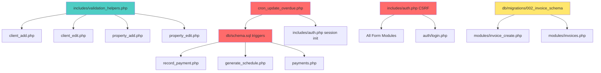

**Legend:**
- Red: Critical priority (data integrity/security core)
- Teal: Medium priority (validation enhancements)
- Yellow: Schema changes (requires careful migration)

---

### 15.9 Testing Requirements by File

| File Modified | Test Cases Required | Test Data Needed |
|--------------|--------------------|-----------------|
| `db/schema.sql` | Trigger execution tests | Sample payments, schedules |
| `record_payment.php` | Payment + deletion scenarios | Property with schedules |
| `generate_schedule.php` | Decimal precision verification | Various total_price/term combinations |
| `payments.php` | Query count measurement | 50+ properties dataset |
| `dashboard.php` | Load time measurement | Populated database |
| `auth/login.php` | Rate limiting (5 attempts) | Test user account |
| `includes/auth.php` | Password rehashing | Old hash in database |
| All CSRF-protected forms | Submit without token | Valid form data |
| Client forms | Email/phone validation | Invalid formats |
| Property forms | Future date rejection | Dates > today |

---

### 15.10 Effort Estimation by File

#### Database Files

| File | Complexity | Estimated Time | Developer Skill Required | Notes |
|------|-----------|----------------|--------------------------|-------|
| `db/schema.sql` | High | 4-6 hours | Senior (SQL expert) | Complex trigger logic; extensive testing needed |
| `db/migrations/001_add_payment_triggers.sql` | High | 3-4 hours | Senior (SQL expert) | New trigger creation; must handle edge cases |
| `db/migrations/002_fix_invoice_schema.sql` | Medium | 2-3 hours | Mid-level | Schema change + data migration |
| `db/migrations/003_add_payment_applications.sql` | Medium | 2-3 hours | Mid-level | Optional/future implementation |

**Database Total:** 11-16 hours

---

#### Core Application Files (Critical Path)

| File | Complexity | Estimated Time | Developer Skill Required | Notes |
|------|-----------|----------------|--------------------------|-------|
| `modules/record_payment.php` | Low | 0.5-1 hour | Mid-level | Simple deletion of lines 149-157 + CSRF |
| `modules/generate_schedule.php` | Medium | 2-3 hours | Mid-level | Decimal precision fix + testing + CSRF |
| `cron_update_overdue.php` | Medium | 2-3 hours | Mid-level | New file creation; cron setup |
| `includes/auth.php` | Medium | 2-3 hours | Senior | Password rehashing + overdue integration |
| `auth/login.php` | Medium | 3-4 hours | Mid-level | Rate limiting logic + session management |

**Core Application Total:** 10-14 hours

---

#### Performance Optimization Files

| File | Complexity | Estimated Time | Developer Skill Required | Notes |
|------|-----------|----------------|--------------------------|-------|
| `modules/payments.php` | Medium-High | 3-5 hours | Senior | Complex query refactoring; performance testing |
| `dashboard.php` | Medium | 2-3 hours | Mid-level | Query consolidation; straightforward |

**Performance Total:** 5-8 hours

---

#### Security Hardening Files

| File | Complexity | Estimated Time | Developer Skill Required | Notes |
|------|-----------|----------------|--------------------------|-------|
| Pagination fixes (7 files) | Low | 0.25 hour × 7 = 1.75 hours | Junior-Mid | Simple max(1, ...) addition |
| CSRF implementation (13 files) | Low-Medium | 0.5 hour × 13 = 6.5 hours | Mid-level | Repetitive but needs careful testing |

**Security Total:** 8-9 hours

---

#### Validation Enhancement Files

| File | Complexity | Estimated Time | Developer Skill Required | Notes |
|------|-----------|----------------|--------------------------|-------|
| `includes/validation_helpers.php` | Medium | 3-4 hours | Mid-level | New utility library; reusable functions |
| `modules/client_add.php` | Low | 1-1.5 hours | Mid-level | Apply validation functions + CSRF |
| `modules/client_edit.php` | Low | 1-1.5 hours | Mid-level | Apply validation functions + CSRF |
| `modules/property_add.php` | Low | 1-1.5 hours | Mid-level | Date validation + CSRF |
| `modules/property_edit.php` | Low | 1-1.5 hours | Mid-level | Date validation + CSRF |
| `modules/invoice_create.php` | Low | 1-1.5 hours | Mid-level | Date validation + CSRF |

**Validation Total:** 8.5-12 hours

---

#### Testing & Quality Assurance

| Activity | Estimated Time | Notes |
|----------|----------------|-------|
| Unit testing (database triggers) | 4-6 hours | Critical; extensive scenarios |
| Integration testing (payment flow) | 3-4 hours | End-to-end payment scenarios |
| Security testing (CSRF, rate limiting) | 2-3 hours | Penetration testing |
| Performance testing | 2-3 hours | Load testing with large datasets |
| Regression testing | 3-4 hours | Ensure no existing functionality broken |
| UAT & documentation | 2-3 hours | User acceptance testing |

**Testing Total:** 16-23 hours

---

#### Overall Effort Summary

| Phase | Estimated Hours | Estimated Days (8hr/day) |
|-------|----------------|-------------------------|
| Database changes | 11-16 hours | 1.5-2 days |
| Core application fixes | 10-14 hours | 1.5-2 days |
| Performance optimization | 5-8 hours | 0.5-1 day |
| Security hardening | 8-9 hours | 1-1.5 days |
| Validation enhancements | 8.5-12 hours | 1-1.5 days |
| Testing & QA | 16-23 hours | 2-3 days |
| **Total Development Time** | **59-82 hours** | **7.5-10 days** |
| Contingency buffer (20%) | 12-16 hours | 1.5-2 days |
| **Total Project Time** | **71-98 hours** | **9-12 days** |

**Recommended Timeline:** 2-3 weeks with 1 developer, or 1-1.5 weeks with 2 developers working in parallel

---

### 15.11 Risk Assessment by File

#### Critical Risk Files (High Impact if Failed)

| File | Risk Level | Failure Impact | Mitigation Strategy |
|------|-----------|----------------|---------------------|
| `db/schema.sql` (triggers) | **HIGH** | Data corruption; incorrect payment status across system | Extensive testing in staging; rollback script ready; backup before deployment |
| `modules/record_payment.php` | **MEDIUM-HIGH** | Payment recording failures; status inconsistency | Keep transaction wrapper; test with various payment amounts |
| `cron_update_overdue.php` | **MEDIUM** | Overdue schedules not updated; reports inaccurate | Dual mechanism (cron + app-level); monitoring alerts |
| `modules/payments.php` | **MEDIUM** | Page load failures; performance degradation | Thorough query testing; keep original code commented for quick rollback |
| `auth/login.php` | **MEDIUM** | User lockouts; login failures | Session-based (easily cleared); admin bypass mechanism |

---

#### Medium Risk Files (Moderate Impact)

| File | Risk Level | Failure Impact | Mitigation Strategy |
|------|-----------|----------------|---------------------|
| `dashboard.php` | **MEDIUM** | Slow dashboard; incorrect statistics | Performance testing; query validation |
| `includes/auth.php` | **MEDIUM** | Password rehashing failures; session issues | Try-catch around rehash; login succeeds even if rehash fails |
| `modules/generate_schedule.php` | **LOW-MEDIUM** | Rounding errors persist; schedule generation fails | Verification query after generation; extensive test cases |
| Invoice schema changes | **MEDIUM** | Data loss; relationship breaks | Complete data backup; manual review of migrations |

---

#### Low Risk Files (Minimal Impact)

| File | Risk Level | Failure Impact | Mitigation Strategy |
|------|-----------|----------------|---------------------|
| Pagination fixes | **LOW** | Minor: page navigation issues | Simple logic; easy to test and fix |
| CSRF implementations | **LOW** | Form submission failures (user sees error) | Standard pattern; clear error messages |
| Validation enhancements | **LOW** | User sees validation errors (expected) | Client-side + server-side validation |
| Date validation | **LOW** | Invalid dates rejected (desired behavior) | Clear error messages to users |

---

#### Risk Matrix

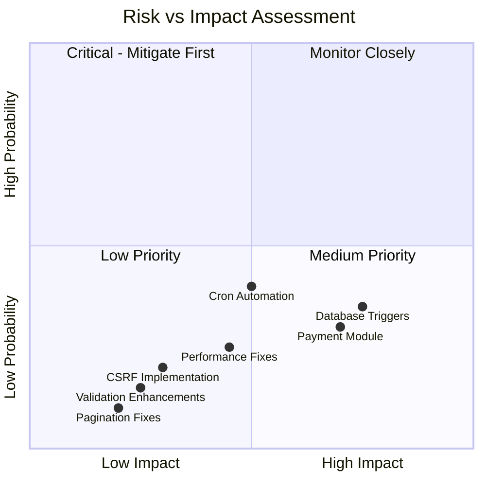

---

#### Risk Mitigation Checklist

**Pre-Implementation:**
- [ ] Full database backup created
- [ ] Staging environment setup with production-like data
- [ ] Rollback scripts prepared for all schema changes
- [ ] Code repository tagged with pre-implementation version

**During Implementation:**
- [ ] Database changes tested in isolation before application changes
- [ ] Each trigger tested with insert/update/delete scenarios
- [ ] Payment flow tested with edge cases (₱0.01, large amounts, deletions)
- [ ] Performance benchmarks measured before and after
- [ ] Security testing completed (CSRF bypass attempts, SQL injection)

**Post-Implementation:**
- [ ] Monitoring alerts configured for cron job failures
- [ ] Data integrity audit queries scheduled (daily for 1 week)
- [ ] User feedback channel established
- [ ] Incident response plan documented
- [ ] Team trained on new validation rules and error messages

---

#### Rollback Risk Assessment

| Component | Rollback Complexity | Data Loss Risk | Rollback Time |
|-----------|---------------------|----------------|---------------|
| Database triggers | Medium | Low (triggers don't delete data) | 5-10 minutes |
| Schema changes (invoices) | High | Medium (if not backed up) | 30-60 minutes |
| Application code | Low | None | 2-5 minutes (git revert) |
| Cron job | Low | None | 1 minute (disable) |

**Rollback Strategy Priority:**
1. Disable cron job (if causing issues)
2. Revert application code via Git
3. Drop new triggers if causing corruption
4. Restore database schema from backup (last resort)

---

### 15.12 Dependency & Blocking Issues

#### Implementation Dependencies

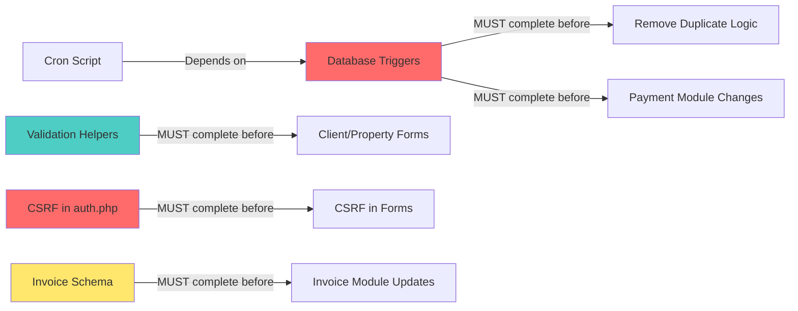

**Blocking Dependencies:**

| Task | Blocks | Cannot Start Until |
|------|--------|-------------------|
| Remove duplicate status update in record_payment.php | Testing of payment flow | Database triggers deployed and tested |
| CSRF implementation in forms | Form functionality | CSRF functions verified in auth.php |
| Invoice module updates | Invoice workflow | Invoice schema migration complete |
| Validation in client/property forms | Data quality improvements | validation_helpers.php created |
| Performance testing | Optimization verification | N+1 query fix and dashboard consolidation complete |

---

#### Recommended Implementation Sequence

**Week 1: Critical Foundation**
1. Day 1-2: Database triggers + testing
2. Day 3: Remove duplicate logic in record_payment.php
3. Day 4: Decimal precision fix in generate_schedule.php
4. Day 5: Cron automation setup + integration testing

**Week 2: Security & Performance**
1. Day 1: CSRF implementation (all 13 forms)
2. Day 2: Pagination fixes + rate limiting
3. Day 3: Password rehashing + security testing
4. Day 4: N+1 query fix + dashboard optimization
5. Day 5: Performance testing

**Week 3: Polish & Validation**
1. Day 1-2: Validation helpers + form updates
2. Day 3: Invoice schema migration
3. Day 4: Regression testing
4. Day 5: UAT + documentation

---

## 16. Conclusion

This design addresses 16 critical issues across data integrity, security, performance, and validation. The phased implementation approach prioritizes high-impact fixes while maintaining system stability. All changes are designed to be backward-compatible where possible, with clear rollback procedures for risk mitigation.

**Key Improvements:**
- Centralized status management eliminates duplication
- Automated overdue detection ensures data accuracy
- Comprehensive security hardening protects against common attacks
- Query optimization reduces database load by 85-95%
- Enhanced validation improves data quality

**Files Impact Summary:**
- 23 existing files require modification
- 4 new files to be created
- 27 total files affected
- Critical path: 6 files must be fixed first

**Next Steps:**
1. Review and approve design document
2. Create detailed implementation tasks for Phase 1
3. Set up staging environment for testing
4. Begin Phase 1 implementation with critical path files
