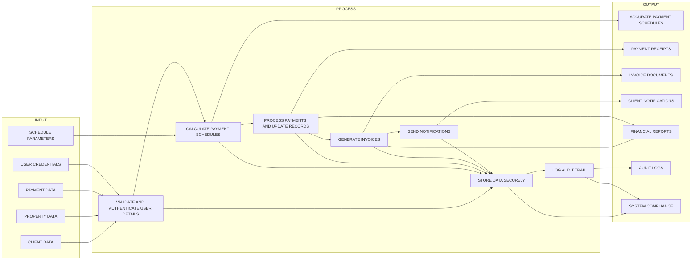

# Operational Framework Diagram

```mermaid
graph LR
    subgraph INPUT
        I1[CLIENT DATA]
        I2[PROPERTY DATA]
        I3[PAYMENT DATA]
        I4[SCHEDULE PARAMETERS]
        I5[USER CREDENTIALS]
    end
    
    subgraph PROCESS
        P1[VALIDATE AND AUTHENTICATE USER DETAILS]
        P2[CALCULATE PAYMENT SCHEDULES]
        P3[PROCESS PAYMENTS AND UPDATE RECORDS]
        P4[GENERATE INVOICES]
        P5[SEND NOTIFICATIONS]
        P6[STORE DATA SECURELY]
        P7[LOG AUDIT TRAIL]
    end
    
    subgraph OUTPUT
        O1[ACCURATE PAYMENT SCHEDULES]
        O2[PAYMENT RECEIPTS]
        O3[INVOICE DOCUMENTS]
        O4[CLIENT NOTIFICATIONS]
        O5[FINANCIAL REPORTS]
        O6[AUDIT LOGS]
        O7[SYSTEM COMPLIANCE]
    end
    
    I1 --> P1
    I2 --> P1
    I3 --> P1
    I4 --> P2
    I5 --> P1
    
    P1 --> P2
    P2 --> P3
    P3 --> P4
    P4 --> P5
    P1 --> P6
    P2 --> P6
    P3 --> P6
    P4 --> P6
    P5 --> P6
    P6 --> P7
    
    P2 --> O1
    P3 --> O2
    P4 --> O3
    P5 --> O4
    P4 --> O5
    P3 --> O5
    P7 --> O6
    P6 --> O7
    P7 --> O7
```

## Alternative: Simplified Three-Column Layout

```mermaid
flowchart LR
    subgraph INPUT
        direction TB
        I1[CLIENT DATA<br/>Name, Email, Phone<br/>Address, Documents]
        I2[PROPERTY DATA<br/>Property Name<br/>Location, Price<br/>Terms, Payment Info]
        I3[PAYMENT DATA<br/>Amount Paid<br/>Payment Date<br/>Receipt Number]
        I4[SCHEDULE<br/>PARAMETERS<br/>Start Date<br/>Monthly Amount<br/>Number of Terms]
        I5[USER<br/>CREDENTIALS<br/>Username<br/>Password<br/>Role]
    end
    
    subgraph PROCESS
        direction TB
        P1[VALIDATE AND<br/>AUTHENTICATE<br/>USER DETAILS<br/>SECURELY]
        P2[CALCULATE<br/>PAYMENT<br/>SCHEDULES<br/>AND BALANCES]
        P3[PROCESS<br/>PAYMENTS<br/>UPDATE RECORDS<br/>GENERATE RECEIPTS]
        P4[GENERATE<br/>INVOICES<br/>AND REPORTS]
        P5[SEND<br/>NOTIFICATIONS<br/>EMAIL/SMS]
        P6[STORE DATA<br/>SECURELY<br/>IN DATABASE]
        P7[LOG AUDIT<br/>TRAIL<br/>ALL ACTIVITIES]
    end
    
    subgraph OUTPUT
        direction TB
        O1[ACCURATE<br/>PAYMENT<br/>SCHEDULES<br/>WITH DUE DATES]
        O2[PAYMENT<br/>RECEIPTS<br/>AND<br/>CONFIRMATIONS]
        O3[INVOICE<br/>DOCUMENTS<br/>PRINTABLE<br/>RECORDS]
        O4[CLIENT<br/>NOTIFICATIONS<br/>REMINDERS<br/>ALERTS]
        O5[FINANCIAL<br/>REPORTS<br/>AGING ANALYSIS<br/>DASHBOARD]
        O6[AUDIT LOGS<br/>USER ACTIVITIES<br/>SYSTEM EVENTS]
        O7[SYSTEM<br/>COMPLIANCE<br/>DATA INTEGRITY<br/>SECURITY]
    end
    
    INPUT ==> PROCESS
    PROCESS ==> OUTPUT
```
